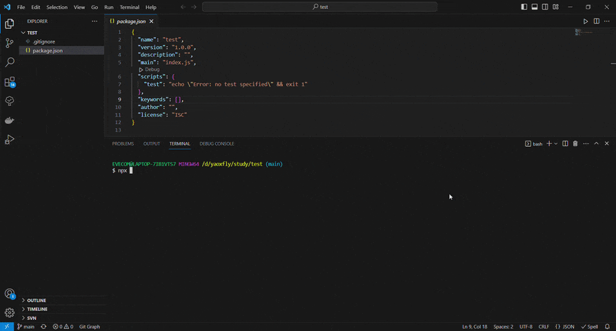
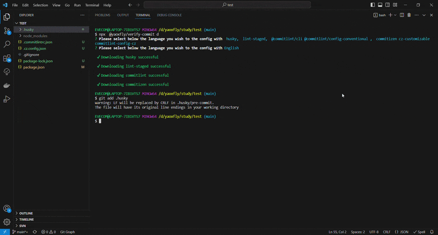

## @yaoxfly/verify-commit
Say goodbye to cumbersome configurations, an npx command automatically downloads husky, lint-staged, commitlint, commitizen, cz-customizable, etc., and completes the relevant configurations.





## Use
```
npx  @yaoxfly/verify-commit d
```
Quick language selection
```
npx  @yaoxfly/verify-commit d -l zh-hans  // Simplified Chinese
```

## Type
Common types are (based on Angular specification extensions)
|type|description|
|:--|:--|
|feat|New features, pages|
|fix|fix a bug|
|patch|make an important patch|
|docs|Modify and add documents and comments|
|config|Modify the configuration file|
|chore|Other changes that don't modify src or test files|
|ci|Changes to our CI configuration files and scripts (example scopes: Husky, Eslint, commitizen)|
|style|Changes that do not affect the meaning of the code (white-space, formatting, missing semi-colons, etc)|
|perf|A code change that improves performance|
|refactor|A code change that neither fixes a bug nor adds a feature|
|build|Changes that affect the build system or external dependencies (example scopes: vite,rollup,webpack)|
|tag|Make a git tag|
|delete|Delete useless folders and files|
|init|Initialize the project|
|test|Adding missing tests or correcting existing tests|
|revert|Reverts a previous commit|

You can customize the type and modify it in the `.cz.config.json` file

## Changelog
update log [CHANGELOG](https://github.com/yaoxfly/common/blob/main/packages/verify-commit/CHANGELOG.md)

## References
+ [Husky](https://typicode.github.io/husky/)    
+ [lint-staged](https://github.com/okonet/lint-staged)
+ [commitlint](https://github.com/conventional-changelog/commitlint)
+ [commitizen](https://github.com/commitizen-tools/commitizen)
+ [cz-customizable](https://github.com/leoforfree/cz-customizable)


